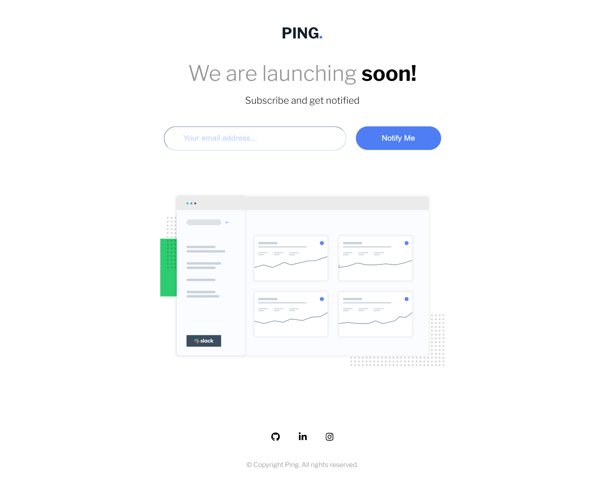
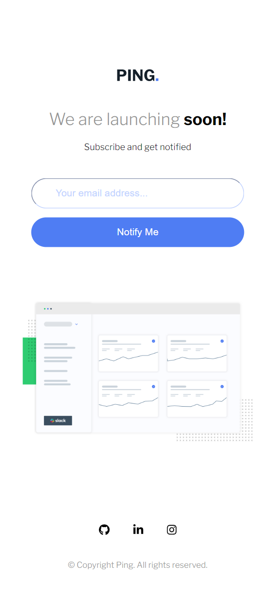

# Coming Soon page

## Bem vindo! 👋

Obrigado por verificar meu projeto front-end.

Estou constantemente aprimorando minhas habilidades em HTML e CSS para fazer mais projetos como este.

## Objetivo do Projeto

Eu queria mostrar no que estou trabalhando, para que as pessoas me reconheçam como um verdadeiro designer de front-end. 
Meu desejo é lidar com mais e maiores projetos como este. Então, eu adoraria qualquer sugestão de desafio!

## Designe do Projeto

Resolvi construir um Cartão de visualização de 3 colunas, que é um desafio da > https://www.frontendmentor.io/  
Lá eu posso ter as imagens, textos, cores usadas e fontes de letras para trabalhar, e eles me pedem para fazer todo esse design sozinho, assim como demonstrado.

Aqui você pode ver uma prévia deste projeto visto por uma tela de desktop, o que significa que é uma largura mínima de tela de 1024px:

  

E esta é uma prévia de uma tela de celular (com largura de tela menor que 1024px):

  

## Construção do projeto

>Primeiro passo, estruturar o arquivo index.html de forma semantica como boas praticas;
>Segundo, buscar as fontes utilizadas em https://fonts.google.com/ e declarar no cabeçalho assim também como as paginas de estilo reset.css e style.css;
>Terceiro, começar a estilização da pagina pelo style.css a partir da estratégia "Mobile First";
>Quarto, implementar o display responsivo para desktop a partir de 1024px;
